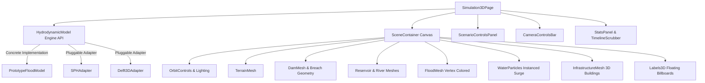

# FloodHADR: Interactive 3D Hydrodynamic Twin & Dam-Break Inundation Module

> **Smart India Hackathon 2026 Prototype**  
> **Problem Statement ID**: 26161  
> **Title**: Dam Break Inundation Modelling Using Hydrodynamic Modelling of any River  
> **Theme**: Disaster Management  
> **Organization**: National Technical Research Organisation (NTRO)  
> **Platform**: FloodHADR Decision Support System

---

## 1. Overview & System Scope

The **3D Twin Simulation Module** in FloodHADR provides a realistic, interactive, web-based 3D digital twin of a river valley dam breach scenario. Built specifically for high-impact decision support and live demonstration during SIH 2026, it visualizes the complete temporal-spatial progression of a dam collapse:

$$\text{DAM} \longrightarrow \text{RESERVOIR} \longrightarrow \text{BREACH} \longrightarrow \text{WATER RELEASE} \longrightarrow \text{RIVER} \longrightarrow \text{FLOOD PROPAGATION} \longrightarrow \text{INUNDATED AREA} \longrightarrow \text{AFFECTED INFRASTRUCTURE}$$

---

## 2. Technical Architecture & Technology Stack



- **Render Engine**: Three.js via `@react-three/fiber` (v9) & `@react-three/drei` (v10).
- **State & UI**: React 19, TypeScript, Tailwind CSS, Lucide React icons.
- **Physics Framework**: Object-Oriented `HydrodynamicModel` abstraction with decoupled time scrubbing (0 to 120 minutes) and 60 FPS requestAnimationFrame rendering loop.

---

## 3. 6-Stage Animation & Physical Progression

The 3D visualization models dam-break fluid propagation across **6 distinct stages**:

1. **STAGE 1: DAM INTACT (Baseline Reservoir)** ($t = 0 \text{ min}$)
   - Reservoir water level is at full capacity ($100\,\text{m}$ elevation). Downstream river flows at baseline discharge ($1.4\,\text{m/s}$).
2. **STAGE 2: BREACH INITIATION** ($t \approx 5\text{--}10 \text{ min}$)
   - Structural breach forms in the concrete dam wall. High-velocity water jets spray through the breach orifice.
3. **STAGE 3: WATER ESCAPE / SURGE** ($t \approx 10\text{--}20 \text{ min}$)
   - Reservoir water rushes out through the widening breach section ($50\text{--}120\,\text{m}$). Instanced particle surge illuminates high-velocity turbulent discharge.
4. **STAGE 4: FLOW ACCELERATION** ($t \approx 20\text{--}40 \text{ min}$)
   - Flood wave accelerates down the downstream river valley, breaching river banks and approaching critical bridges.
5. **STAGE 5: WAVE PROPAGATION** ($t \approx 40\text{--}70 \text{ min}$)
   - Flood crest spreads sideways into floodplain settlements, surrounding houses, schools, and substations.
6. **STAGE 6: MAXIMUM INUNDATION** ($t \ge 70 \text{ min}$)
   - Water reaches maximum spatial extent ($24.8\,\text{km}^2$), peak velocity ($8.5\,\text{m/s}$), and maximum inundation depth ($14.2\,\text{m}$). Impacted infrastructure is dynamically flagged.

---

## 4. Object-Oriented Simulation Architecture

The engine architecture utilizes a pluggable model interface (`HydrodynamicModel.ts`):

```typescript
export interface HydrodynamicModel {
  engineName: string;
  isEngineAvailable: boolean;
  initialize(params: ScenarioParams): void;
  run(): void;
  pause(): void;
  reset(): void;
  scrubToTime(timeMin: number): void;
  getState(): HydroSimulationState;
  getIsRunning(): boolean;
}
```

### Supported Adapters:
1. **`PrototypeFloodModel`** *(Active Default)*:
   - High-performance, client-side diffusive wave cellular model. Computes real-time depth fields, wave front velocities, flooded surface areas, and affected asset counts.
2. **`SPHAdapter`** *(Experimental)*:
   - Smoothed Particle Hydrodynamics adapter for meshfree Lagrangian fluid particles.
3. **`Delft3DAdapter`** *(External Server Bridge)*:
   - Pre-configured adapter for Delft3D-FM clusters. Explicitly notifies user when unconfigured: `"Delft3D external engine not configured."`.

---

## 5. Component Breakdown

| Component | Location | Description |
| :--- | :--- | :--- |
| `Simulation3DPage.tsx` | `frontend/src/pages/` | Master page coordinating state, controls, modals, and canvas layout. |
| `SceneContainer.tsx` | `frontend/src/components/3d/` | R3F Canvas wrapper with directional sunlight, ambient fill, fog, and camera transition controller. |
| `TerrainMesh.tsx` | `frontend/src/components/3d/` | Procedurally generated river valley mesh with high elevation mountains and low river channel. |
| `DamMesh.tsx` | `frontend/src/components/3d/` | Concrete dam structure with dynamic trapezoidal breach opening based on breach width and time parameters. |
| `ReservoirMesh.tsx` | `frontend/src/components/3d/` | Animated reservoir surface with water displacement wave animation. |
| `RiverMesh.tsx` | `frontend/src/components/3d/` | Baseline winding river ribbon mesh. |
| `FloodMesh.tsx` | `frontend/src/components/3d/` | Downstream flood water surface supporting **Depth** (Cyan to Dark Blue), **Velocity** (Yellow to Crimson), and **Inundation** color modes. |
| `WaterParticles.tsx` | `frontend/src/components/3d/` | High-performance Three.js `InstancedMesh` spraying turbulent water droplets from the dam breach orifice. |
| `InfrastructureMesh.tsx` | `frontend/src/components/3d/` | 3D models for Residential Clusters, Highway Bridge, Hospital, School, Substation, and Primary Road. Features real-time state changes (`SAFE` / `FLOOD IMPACT`). |
| `Labels3D.tsx` | `frontend/src/components/3d/` | HTML 3D spatial markers using `@react-three/drei` `Html` element (`DAM`, `RESERVOIR`, `BREACH`, `RIVER`, `FLOOD FRONT`, `BRIDGE`, `HOSPITAL`, `SCHOOL`, `SUBSTATION`). |
| `ScenarioControlsPanel.tsx` | `frontend/src/components/Controls/` | Left floating panel for preset selection (Scenario A/B/C), water height sliders, breach width, formation time, simulation duration, and play/pause controls. |
| `CameraControlsBar.tsx` | `frontend/src/components/Controls/` | Top bar with camera presets (`3D VIEW`, `TOP VIEW`, `DAM VIEW`, `RESET`), color mode toggles, and Depth Legend. |
| `DEMLoaderModal.tsx` | `frontend/src/components/Controls/` | Modal for ingesting custom GeoTIFF DEM rasters (Cartosat, SRTM, ALOS PALSAR). |
| `StatsPanel.tsx` | `frontend/src/components/Statistics/` | Right side telemetry panel showing instantaneous depth, velocity, affected assets, and model engine status. |
| `ComparisonModal.tsx` | `frontend/src/components/Statistics/` | Multi-scenario comparison matrix comparing Scenario A (Catastrophic Breach), Scenario B (Partial Overtopping), and Scenario C (Piping Failure). |
| `TimelineScrubber.tsx` | `frontend/src/components/Timeline/` | Bottom interactive timeline scrubber with play/pause, time display ($0\text{--}120\,\text{min}$), speed multiplier ($1\times, 2\times, 5\times, 10\times$), and stage indicator. |

---

## 6. Downstream Infrastructure Assets & Impact Matrix

The digital twin includes synthetic downstream critical infrastructure:

| Asset Name | Type | Coordinates (X, Z) | Elevation (Y) | Inundation Depth Threshold | Impact Behavior |
| :--- | :--- | :--- | :--- | :--- | :--- |
| **Downstream Valley Village** | Residential | `(15, 60)` | $2.5\,\text{m}$ | $> 1.5\,\text{m}$ | Walls turn crimson; HUD status switches to `FLOOD AFFECTED` |
| **Highway River Bridge** | Transportation | `(0, 110)` | $5.0\,\text{m}$ | $> 4.0\,\text{m}$ | Bridge deck submerged; warning alert activated |
| **Valley Primary School** | Educational | `(-25, 140)` | $4.0\,\text{m}$ | $> 2.0\,\text{m}$ | Submerged; status updated to `CRITICAL IMPACT` |
| **District Emergency Hospital**| Healthcare | `(30, 180)` | $7.0\,\text{m}$ | $> 3.0\,\text{m}$ | Submerged; HADR rescue priority flagged |
| **Regional Power Substation** | Energy | `(-35, 90)` | $3.0\,\text{m}$ | $> 1.0\,\text{m}$ | Submerged; blackout risk flagged |

---

## 7. Disclaimers & Limitations

> [!WARNING]
> **PROTOTYPE VISUALIZATION DISCLAIMER**  
> 1. The 3D scene presented in this module is a **demonstration prototype built with synthetic terrain and procedural fluid mesh animation**.  
> 2. It **does NOT** represent validated hydrodynamic outputs from real-world dam break measurements or real GIS elevation models unless coupled with an active Delft3D or SPH backend solver.  
> 3. The Delft3D adapter displays `"Delft3D external engine not configured."` when an external high-performance computing cluster is not connected.

---

## 8. Technical Integration Roadmap

1. **Backend DEM Processing**: Integrate `rasterio` & `pyproj` in the Python FastAPI backend (`/api/v1/dem/ingest`) to generate high-resolution terrain heightmaps directly from uploaded GeoTIFF files.
2. **GPU SPH Solver**: Connect WebGPU / CUDA SPH particle solver for real-time 3D fluid-structure interaction with millions of particles.
3. **Delft3D-FM REST API**: Connect live WebSocket telemetry to pull 3D mesh velocities directly from running Delft3D Flexible Mesh simulations.
4. **Google Earth Engine Satellite Texture Mapping**: Stream Sentinel-2 optical and Sentinel-1 SAR water extent textures onto the 3D terrain surface in real time.
