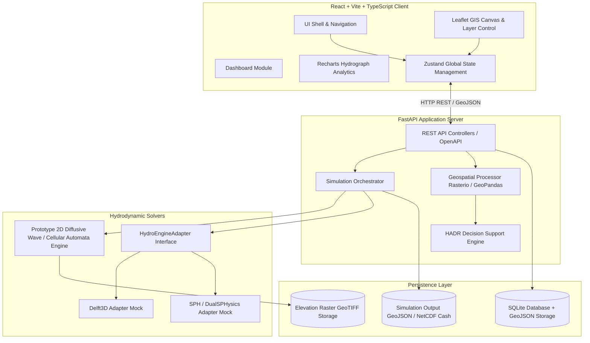

# FloodHADR - Technical Architecture & System Design Document

**Project Title:** FloodHADR – Integrated Dam-Break, Flash-Flood Simulation & HADR Decision Support Platform  
**SIH Problem Statement:** ID 26161 (National Technical Research Organisation - NTRO)  
**Document Version:** 1.0.0  

---

## 1. Problem Statement Analysis & System Objectives

### 1.1 Context & Mandate
Dam failures (caused by overtopping, structural piping, seismic activity, or intense rainfall) release massive kinetic volumes of water downstream within minutes, causing severe loss of life, infrastructure destruction, and regional displacement. 

**NTRO Problem Statement 26161** mandates the development of a comprehensive software solution capable of:
1. **Dam Break Inundation Modeling**: Computing breach parameters (breach width, formation time, discharge rate) and hydrodynamic flood wave propagation across any chosen river basin.
2. **Geospatial & Inundation Visualization**: Displaying temporal flood extent, water depth contours, arrival times, and flow velocities on interactive map interfaces.
3. **HADR Decision Support**: Providing actionable intelligence for disaster responders (identifying inundated assets, calculating population risk indices, suggesting evacuation pathways and emergency shelter assignments).
4. **Extensible Architecture**: Serving as a high-performance web prototype while establishing clear interface contracts to integrate external HPC hydrodynamic solvers (Delft3D, SPH, HEC-RAS 2D).

---

## 2. High-Level Architecture Design

The system adheres to a layered micro-service/decoupled web pattern, separating presentation, application orchestration, numerical modeling, spatial analysis, and data storage.



---

## 3. Frontend Architecture & Page Structure

### 3.1 Technology Choice
- **React 18 & TypeScript**: Component-driven architecture with strict type safety for complex geospatial and hydrodynamic data contracts.
- **Tailwind CSS**: Custom dark glassmorphism design tokens optimized for mission-control disaster dashboards.
- **Leaflet & React-Leaflet**: Hardware-accelerated canvas rendering for large GeoJSON inundation layers, velocity vectors, and dynamic temporal timeline controls.
- **Recharts**: Responsive charting for hydrographs, elevation-volume curves, and cross-section profiles.

### 3.2 Page & Routing Structure

| Route | Page Name | Primary Functionality |
|---|---|---|
| `/` | **Dashboard** | Overview of active river basins, high-risk dams, historical simulation runs, HADR alerts, and quick simulation launcher. |
| `/study-areas` | **Study Area Manager** | Interactive ROI selector (bounding box / polygon tool), DEM file upload, preloaded river basins (Tehri, Hirakud, Mullaperiyar, Idukki). |
| `/dam-data` | **Dam & Reservoir Specs** | Structural parameters (dam height, crest width, spillway capacity, storage-elevation curve, initial reservoir level). |
| `/terrain-data` | **DEM & Roughness Studio** | Digital Elevation Model (DEM) inspector, elevation profile generator, Manning's $n$ land cover roughness map builder. |
| `/scenario-builder` | **Dam Break Scenario Builder** | Configure breach parameters (Failure Mode: Piping vs Overtopping; Breach width, formation time; Ritter/Froehlich hydrograph generator). |
| `/simulation` | **Flood Simulation Engine** | Simulation control center (timestep size, total duration), real-time progress monitor, execution log stream. |
| `/inundation-analysis` | **Inundation Analytics** | Dynamic time-series slider, depth contour classification (<0.5m to >3m), maximum inundation footprint, wave arrival map. |
| `/hadr-impact` | **HADR Decision Support** | Spatial join of flood footprint over infrastructure (hospitals, schools, roads, bridges), affected population tally, evacuation router, shelter matrix. |
| `/map-viewer` | **GIS Map Studio** | Full-screen multi-layer GIS visualization station with opacity controls, velocity vector toggle, basemap switcher, measurement tools. |
| `/compare` | **Scenario Comparator** | Dual-map / split view comparing 2 simulation scenarios (e.g. 50% vs 100% capacity failure) with delta depth calculation. |
| `/export` | **Export & Reporting** | Export simulation outputs as GeoJSON, GeoTIFF, CSV hydrographs, and auto-generated PDF HADR Executive Briefs. |
| `/engine-integrations` | **Future Engines & GEE** | Adapter registry view (Delft3D / SPH status), mock GEE / Copernicus Sentinel-1 SAR imagery overlay toggle. |

---

## 4. Backend Architecture & Service Layers

### 4.1 Layered Design
- **API Controller Layer (`app/api/`)**: FastAPI endpoints for handling HTTP requests, query parameter validation, and response serialization using Pydantic v2 schemas.
- **Service Layer (`app/services/`)**: Business logic for study area creation, dam parameter validation, scenario generation, and HADR spatial join logic.
- **Engine Layer (`app/engine/`)**:
  - `solver.py`: Prototype 2D hydrodynamic solver (Cellular Automata / Diffusive Wave approximation over DEM grid).
  - `breach.py`: Empirical dam breach hydrograph formulas (Froehlich, MacDonald-Langridge-Monopolis, Ritter equation).
  - `adapter_interface.py`: Standardized Abstract Base Class (`HydroEngineAdapter`) defining methods `prepare_input()`, `execute_run()`, and `parse_output()`.
- **Geospatial Processing Layer (`app/gis/`)**:
  - `raster_utils.py`: DEM elevation grid processing, hillshade computation, slope analysis, cell raster indexing via Rasterio.
  - `vector_utils.py`: GeoPandas spatial intersection, buffer zone creation, evacuation routing on road network graphs via Shapely.
- **Data Access Layer (`app/db/`)**: SQLAlchemy 2.0 Async ORM session manager and SQLite repository pattern (extensible to PostgreSQL / PostGIS).

---

## 5. Data Models & Schemas

### 5.1 Database Entity Relationship (ER) Model

```
+-------------------+       +-----------------------+       +-------------------------+
|    StudyArea      |       |        DamSpec        |       |    DamBreakScenario     |
+-------------------+       +-----------------------+       +-------------------------+
| id (PK)           | 1   * | id (PK)               | 1   * | id (PK)                 |
| name              |-------| study_area_id (FK)    |-------| dam_id (FK)             |
| bounding_box_json |       | name                  |       | scenario_name           |
| dem_filepath      |       | height_m              |       | failure_mode            |
| crs_epsg          |       | reservoir_volume_m3   |       | breach_width_m          |
| created_at        |       | crest_elevation_m     |       | breach_formation_hr     |
+-------------------+       +-----------------------+       | peak_discharge_m3s      |
                                                            +-------------------------+
                                                                         | 1
                                                                         |
                                                                         | *
                                                            +-------------------------+
                                                            |     SimulationRun       |
                                                            +-------------------------+
                                                            | id (PK)                 |
                                                            | scenario_id (FK)        |
                                                            | status (PENDING/RUNNING)|
                                                            | total_timesteps         |
                                                            | time_step_sec           |
                                                            | max_inundation_area_km2 |
                                                            | output_geojson_path     |
                                                            | output_geotiff_path     |
                                                            | created_at              |
                                                            +-------------------------+
                                                                         | 1
                                                                         |
                                                                         | 1
                                                            +-------------------------+
                                                            |    HADRImpactReport     |
                                                            +-------------------------+
                                                            | id (PK)                 |
                                                            | simulation_id (FK)      |
                                                            | flooded_hospitals_json  |
                                                            | flooded_bridges_json    |
                                                            | affected_pop_est        |
                                                            | evacuation_routes_json  |
                                                            +-------------------------+
```

---

## 6. REST API Specification

### 6.1 Core Endpoints

#### Study Areas & DEM
- `GET /api/v1/study-areas/` - List all registered river basins & study areas.
- `POST /api/v1/study-areas/` - Register a new study area ROI / upload DEM GeoTIFF.
- `GET /api/v1/study-areas/{id}/dem-profile` - Fetch elevation profile cross-section along a line geometry.

#### Dam Specifications
- `GET /api/v1/dams/` - List dams associated with study areas.
- `POST /api/v1/dams/` - Create/update dam parameters and storage-elevation curves.

#### Scenario Builder & Hydrograph
- `POST /api/v1/scenarios/breach-hydrograph` - Compute empirical breach hydrograph (discharge vs time) given dam dimensions and failure mode.
- `POST /api/v1/scenarios/` - Save a complete dam-break scenario.

#### Simulation Engine
- `POST /api/v1/simulations/run` - Trigger 2D flood inundation simulation job (asynchronous execution).
- `GET /api/v1/simulations/{id}/status` - Query simulation progress status (% complete, current timestep).
- `GET /api/v1/simulations/{id}/results` - Retrieve simulation output summary, hydrographs, and spatial layers.
- `GET /api/v1/simulations/{id}/layer?time_step={t}` - Fetch inundation depth GeoJSON / vector tile for a specific time step.

#### HADR Decision Support
- `GET /api/v1/hadr/impact-assessment/{simulation_id}` - Perform spatial overlay against critical infrastructure layers and return threat tally.
- `GET /api/v1/hadr/evacuation-plan/{simulation_id}` - Generate recommended evacuation routes and shelter capacity assignments.

#### Export & Reports
- `GET /api/v1/export/pdf-report/{simulation_id}` - Download compiled HADR Executive Brief PDF.
- `GET /api/v1/export/geotiff/{simulation_id}` - Download peak inundation depth GeoTIFF raster.

---

## 7. Numerical Simulation Pipeline & Hydrodynamic Solver

### 7.1 Breach Hydrograph Generation
The engine uses empirical dam breach formulation:
- **Froehlich (2008)** equation for breach width $B_{avg}$ and formation time $t_f$:
  $$B_{avg} = 0.27 V_w^{0.32} h_b^{0.45}$$
  $$t_f = 63.2 \sqrt{\frac{V_w}{g h_b^2}}$$
- **Peak Breach Discharge $Q_p$** calculated using Froehlich / MacDonald-Langridge-Monopolis / Ritter dam-break formulation:
  $$Q_p = 0.607 V_w^{0.295} h_b^{1.24}$$

### 7.2 Prototype 2D Inundation Propagation Solver
To ensure rapid execution in a web demonstration without requiring HPC infrastructure, the prototype engine implements a **Diffusive Wave / Cellular Automata 2D Raster Propagation Model**:
1. **Grid Representation**: DEM elevation matrix $Z(x, y)$ of size $M \times N$.
2. **Water Storage Matrix**: Water depth $H(x, y, t)$ and total water surface elevation $W(x,y,t) = Z(x,y) + H(x,y,t)$.
3. **Flux Computation**: Water transfer between adjacent grid cells $(i, j) \rightarrow (k, l)$ calculated via Manning's equation based on water surface head gradient $\Delta W$ and surface roughness $n$:
   $$Q = \frac{1}{n} A R^{2/3} S_f^{1/2}$$
4. **Conservation of Mass**: Cell depth update at step $t + \Delta t$:
   $$H_{t+\Delta t} = H_t + \frac{\sum Q_{in} - \sum Q_{out}}{\Delta x \cdot \Delta y} \Delta t$$
5. **Output Matrices**:
   - Depth Matrix $D(x, y, t)$
   - Velocity Matrix $V(x, y, t)$
   - Arrival Time Matrix $T_{arr}(x, y)$ (time step when depth first exceeds $0.1\text{ m}$)

---

## 8. Directory & File Structure

```
FloodHADR/
├── README.md
├── ARCHITECTURE.md
├── DEVELOPMENT_PLAN.md
├── frontend/
│   ├── package.json
│   ├── vite.config.ts
│   ├── tsconfig.json
│   ├── tailwind.config.js
│   ├── index.html
│   └── src/
│       ├── main.tsx
│       ├── App.tsx
│       ├── index.css
│       ├── types/
│       │   ├── gis.ts
│       │   ├── simulation.ts
│       │   └── hadr.ts
│       ├── services/
│       │   └── api.ts
│       ├── store/
│       │   └── useAppStore.ts
│       ├── components/
│       │   ├── common/
│       │   │   ├── Navbar.tsx
│       │   │   ├── Sidebar.tsx
│       │   │   └── Card.tsx
│       │   ├── map/
│       │   │   ├── GISMap.tsx
│       │   │   ├── LayerControl.tsx
│       │   │   └── TimeSlider.tsx
│       │   ├── analytics/
│       │   │   ├── HydrographChart.tsx
│       │   │   └── DepthDistributionChart.tsx
│       │   └── hadr/
│       │       ├── InfrastructureList.tsx
│       │       ├── PopulationRiskCard.tsx
│       │       └── EvacuationRoutePanel.tsx
│       └── pages/
│           ├── DashboardPage.tsx
│           ├── StudyAreasPage.tsx
│           ├── DamDataPage.tsx
│           ├── ScenarioBuilderPage.tsx
│           ├── SimulationPage.tsx
│           ├── InundationAnalysisPage.tsx
│           ├── HADRImpactPage.tsx
│           ├── GISMapPage.tsx
│           ├── ComparePage.tsx
│           ├── ExportPage.tsx
│           └── ExternalEnginesPage.tsx
└── backend/
    ├── requirements.txt
    ├── main.py
    ├── app/
    │   ├── __init__.py
    │   ├── config.py
    │   ├── api/
    │   │   ├── __init__.py
    │   │   ├── router.py
    │   │   ├── study_areas.py
    │   │   ├── dams.py
    │   │   ├── scenarios.py
    │   │   ├── simulations.py
    │   │   ├── hadr.py
    │   │   └── export.py
    │   ├── services/
    │   │   ├── study_area_service.py
    │   │   ├── breach_service.py
    │   │   ├── simulation_service.py
    │   │   └── hadr_service.py
    │   ├── engine/
    │   │   ├── __init__.py
    │   │   ├── breach_hydrograph.py
    │   │   ├── prototype_solver.py
    │   │   ├── adapters/
    │   │   │   ├── base_adapter.py
    │   │   │   ├── delft3d_adapter.py
    │   │   │   └── sph_adapter.py
    │   │   └── grid_generator.py
    │   ├── gis/
    │   │   ├── raster_processor.py
    │   │   ├── vector_processor.py
    │   │   └── hadr_analyzer.py
    │   └── db/
    │       ├── database.py
    │       ├── models.py
    │       └── schemas.py
    └── data/
        ├── sample_dems/
        ├── sample_infrastructure/
        └── demo_scenarios.json
```

---

## 9. Future Integration & Extensibility Framework

### 9.1 Adapter Contract (`HydroEngineAdapter`)
To transition from the web prototype solver to high-performance physical hydrodynamic engines, the system defines an object-oriented adapter abstraction:

```python
from abc import ABC, abstractmethod
from typing import Dict, Any

class HydroEngineAdapter(ABC):
    
    @abstractmethod
    def prepare_grid_and_inputs(self, dem_path: str, breach_hydrograph: Dict[str, Any]) -> str:
        """Translates FloodHADR terrain and breach specifications into engine-native input files (e.g. Delft3D NetCDF/GRID, SPH particles)."""
        pass
        
    @abstractmethod
    def trigger_execution(self, input_config_path: str) -> str:
        """Dispatches job execution to local subprocess or remote HPC cluster."""
        pass
        
    @abstractmethod
    def parse_output_to_geojson(self, engine_output_path: str) -> Dict[str, Any]:
        """Converts native engine outputs (NetCDF, HDF5, VTK) into standardized GeoJSON depth/velocity grids."""
        pass
```

### 9.2 Integrated Engine Capability Roadmap

```
+-------------------------------------------------------------------------+
|                             FloodHADR Core                              |
+-------------------------------------------------------------------------+
                                     |
         +---------------------------+---------------------------+
         |                           |                           |
         v                           v                           v
+------------------+       +------------------+       +------------------+
| Prototype Solver |       |  Delft3D Adapter |       |   SPH Adapter    |
| (Cellular        |       | (Full 2D Shallow |       | (Smoothed        |
|  Automata -      |       |  Water Hydro-    |       |  Particle Hydro- |
|  Instant Web)    |       |  dynamics)       |       |  dynamics)       |
+------------------+       +------------------+       +------------------+
```

---

## 10. Summary & Compliance Verification

| Requirement | Provision in Architecture | Status |
|---|---|---|
| Dam Break Inundation | Breach hydrograph generator + 2D raster propagation solver | ✅ Architected |
| Any River Basin | Dynamic DEM ingestion & CRS reprojection (Rasterio/PyProj) | ✅ Architected |
| Interactive GIS Map | Leaflet canvas layer with dynamic time step playback slider | ✅ Architected |
| HADR Impact Analysis | GeoPandas spatial join against critical infrastructure & evacuation routing | ✅ Architected |
| External Engine Compatibility | Clean `HydroEngineAdapter` interface for Delft3D & SPH | ✅ Architected |
| Hackathon Prototype Scope | Lightweight Python/FastAPI backend + React frontend | ✅ Architected |
