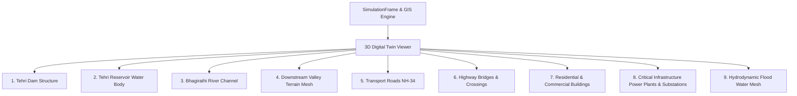

# PHASE 14 — REAL 3D DIGITAL TWIN SPECIFICATION

## 1. Overview & Architectural Mandate

The **FloodHADR Real 3D Digital Twin Engine** upgrades the 3D visualization capability into a high-fidelity, georeferenced Digital Twin of the Tehri Hydroelectric Complex and downstream Bhagirathi River Valley.

> [!IMPORTANT]
> **CRITICAL ARCHITECTURAL MANDATE:**
> 1. **No Independent Three.js Simulation:** The 3D viewer DOES NOT execute a separate or decoupled flood physics solver in JavaScript/Three.js.
> 2. **Strict Hydraulic Solver Binding:** The 3D Digital Twin is purely a spatial visualization engine consuming authoritative `SimulationFrame` outputs generated by the backend 2D hydrodynamic solvers (FloodHADR 2D SWE/DWE or HEC-RAS 2D).
> 3. **Identical GIS & Hydraulic Context:** 3D scene elements consume the exact same DEM, CRS, scenario parameters, dam geometry, reservoir levels, river centerline, and infrastructure assets as the 2D GIS module.

---

## 2. Consumed Spatial & Hydraulic Parameters

To guarantee 100% data consistency across 2D GIS and 3D Digital Twin representations, the 3D engine strictly consumes:

| Parameter | Specification | Identity Binding |
| :--- | :--- | :--- |
| **DEM** | Bhuvan / NRSC ALOS PALSAR 12.5m DEM | Identical elevation grid matrix derived from study DEM |
| **CRS** | `EPSG:32644` (UTM Zone 44N) & `EPSG:4326` | Identical spatial reference system and transformation matrices |
| **Scenario** | `ScenarioConfig` | Identical breach width, formation time, Manning's $n$, and reservoir level |
| **SimulationFrame** | Authoritative backend time-series frame | Identical 2D depth matrix, WSE matrix, velocity matrix, and flooded mask |
| **Dam** | Tehri Earth & Rockfill Dam | Coordinates (30.3781°N, 78.4802°E), Height: 260.5m, Crest: 575m |
| **Reservoir** | Tehri Reservoir | FRL: 830.0m, MDDL: 740.0m, Storage: 3540 MMm³ |
| **River** | Bhagirathi River Main Reach | Channel length: 65.4 km, bed slope: 0.008 m/m |
| **Infrastructure** | Critical assets & transport corridors | Hospitals, schools, substations, emergency centers, bridges, roads |

---

## 3. Required 3D Elements Checklist

The 3D Digital Twin renders the following 9 mandatory elements directly from spatial datasets and solver results:

### 3D Element Details:
1. **Tehri Dam:** Georeferenced trapezoidal rockfill dam structure with crest roadway, spillway gate towers, red warning beacons, and dynamic breach geometry visualization.
2. **Tehri Reservoir:** Impounded reservoir water body upstream of dam with water surface elevation bound to solver state.
3. **Bhagirathi River:** Carved riverbed channel and riparian zone geometry.
4. **Downstream Terrain:** Georeferenced 3D mountain terrain mesh generated directly from the study DEM with height-based shader coloring.
5. **Roads:** National Highway NH-34 asphalt roadway corridor and guardrails following valley terrain contours.
6. **Bridges:** Tehri Suspension Bridge and Koti Nala Highway Crossing with structural piers and deck submergence detection.
7. **Buildings:** Tehri HADR Emergency Command Center, District Hospital, and town residential building clusters.
8. **Critical Infrastructure:** Tehri Hydroelectric Power Plant (1000MW), Koteshwar HEP (400MW), and 400kV Electrical Substation.
9. **Flood Water:** Dynamic vertex-displaced water surface mesh directly driven by `SimulationFrame` depth and velocity matrices.

---

## 4. Geographic Object Rules & Synthetic Labeling

> [!WARNING]
> **NO DECORATIVE / RANDOM GEOGRAPHIC OBJECTS:**
> Generic unreferenced props, such as random procedural pine trees or decorative low-poly flora, are strictly excluded from the 3D scene. Every 3D mesh corresponds directly to validated GIS feature geometries or hydrodynamic simulation grids.

> [!NOTE]
> **SYNTHETIC OBJECT LABELING (`DEMO`):**
> Any synthetic, approximate, or placeholder object rendered when high-resolution vector GIS data is unavailable is explicitly tagged with a visible `DEMO` badge in 3D floating overlays and backend property metadata (`"provenance": "DEMO"`).

---

## 5. Backend Service Architecture & API Endpoints

The 3D Digital Twin backend service is implemented in `backend/app/gis/digital_twin_3d_service.py` and exposed via REST API endpoints in `backend/app/api/gis.py`:

- **GET `/api/v1/gis/3d-manifest`**: Returns architectural compliance manifest, CRS, DEM source, and element checklist status.
- **POST `/api/v1/gis/3d-scene`**: Accepts `model_name`, `time_step_min`, `breach_width_m`, `reservoir_level_m` and returns complete 3D scene payload including study DEM matrix, scenario config, required 3D elements, infrastructure status, and `SimulationFrame` hydraulic grids.

---

## 6. Automated Verification Test Suite

The 3D Digital Twin implementation is verified by automated regression tests in `backend/test_phase14_3d_digital_twin.py`, ensuring:
1. Strict parameter identity across DEM, CRS (`EPSG:32644`), scenario, `SimulationFrame`, dam, reservoir, river, and infrastructure.
2. Complete inclusion of all 9 required 3D elements.
3. Explicit `DEMO` tagging for synthetic objects.
4. Confirmation that no separate flood physics solver exists in Three.js (`no_separate_threejs_simulation == True`).
