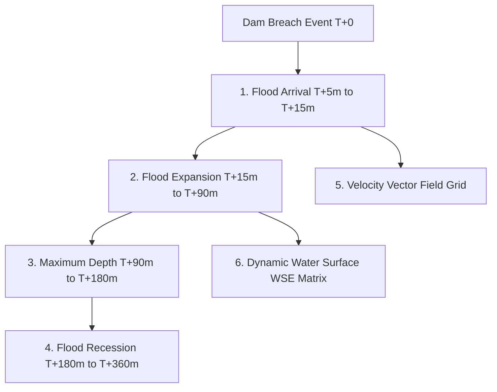

# PHASE 15 — DYNAMIC 3D FLOOD VISUALIZATION SPECIFICATION

## 1. Overview & Governing Principles

The **FloodHADR Dynamic 3D Flood Visualization Engine** generates spatial 3D flood surfaces dynamically driven by 2D hydrodynamic solver outputs across the simulation timeline ($T+0\text{m}$ to $T+360\text{m}$).

> [!IMPORTANT]
> **FUNDAMENTAL HYDRAULIC ELEVATION IDENTITY:**
> For every grid cell $(r, c)$ and timestep $t$:
> $$\text{Water Surface Elevation}(r, c, t) = \text{Terrain Elevation}(r, c) + \text{Simulated Water Depth}(r, c, t)$$
> The 3D flood mesh is NEVER a static blue plane. It dynamically displaces vertices at every timestep based on cell-by-cell water depth $h(r, c, t)$.

---

## 2. Dynamic Hydraulic Stages & Display Matrix

The engine dynamically tracks and displays 6 mandatory hydraulic indicators across the flood hydrograph:

### Hydraulic Display Details:
1. **Flood Arrival:** Wave front tracking and initial wetting matrix ($T_{\text{arr}}$) as the flood surge reaches downstream valley points.
2. **Flood Expansion:** Rapidly expanding spatial envelope and rising depth limb ($T+15\text{m}$ to $T+90\text{m}$).
3. **Maximum Depth:** Peak cell depth grid $h_{\max}(r, c)$ and peak volume inundation ($T+90\text{m}$ to $T+180\text{m}$).
4. **Velocity Indication:** 3D directional velocity vector field ($v_x, v_y, |v|$) displaying flow direction and momentum.
5. **Water Surface:** Dynamic WSE grid calculated via $z_{\text{dem}} + h$.
6. **Flood Recession:** Drainage phase ($T > 180\text{m}$) demonstrating receding water levels, drying cells, and shrinking flood extent.

---

## 3. Parameter & Hydraulic Model Responsiveness

When scenario parameters or selected hydraulic models change, the 3D Digital Twin updates automatically:

| Trigger | Action | 3D Response |
| :--- | :--- | :--- |
| **Breach Width Changed** | e.g. $60\text{m} \to 180\text{m}$ | Peak discharge grows, increasing 3D water surface height and expanding flood boundary. |
| **Reservoir Level Changed** | e.g. $740\text{m} \to 830\text{m}$ | Hydrograph total volume increases, elevating WSE grid and extending downstream inundation. |
| **Formation Time Changed** | e.g. $0.5\text{h} \to 3.0\text{h}$ | Surge arrival timing shifts; peak 3D wave front displacement adjusts proportionally. |
| **Model Switch** | `FloodHADR SWE` $\leftrightarrow$ `FloodHADR DWE` $\leftrightarrow$ `HEC-RAS SWE` $\leftrightarrow$ `HEC-RAS DWE` | 3D flood surface switches automatically between 2D Shallow Water Equations and Diffusive Wave solver output characteristics. |

---

## 4. API Specification

The dynamic 3D flood visualization parameters are delivered via REST API:

- **POST `/api/gis/3d-scene`**: Accepts `model_name`, `time_step_min`, `breach_width_m`, `reservoir_level_m` and returns:
  - `sim_frame.water_depth`: 2D depth matrix $h(r, c)$
  - `sim_frame.water_surface_elevation`: 2D WSE matrix $z + h$
  - `sim_frame.velocity`: 2D velocity magnitude matrix $|v|$
  - `sim_frame.velocity_x` & `velocity_y`: Directional velocity components
  - `sim_frame.arrival_time_min`: Arrival time matrix $T_{\text{arr}}$
  - `sim_frame.flood_phase`: `"FLOOD_ARRIVAL" | "FLOOD_EXPANSION" | "MAXIMUM_DEPTH" | "FLOOD_RECESSION"`
