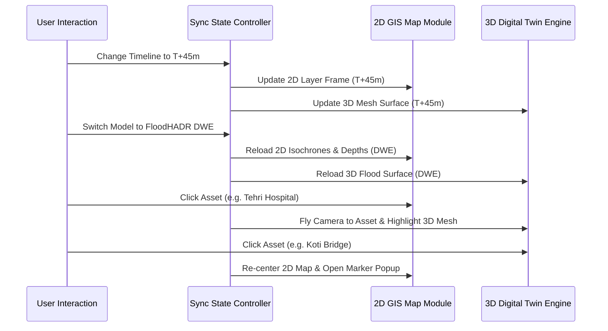

# PHASE 16 — 2D AND 3D SYNCHRONIZATION SPECIFICATION

## 1. Overview & Single Control State Paradigm

The **FloodHADR 2D & 3D Synchronization Architecture** guarantees strict parameter, temporal, model, and spatial identity between the 2D GIS Map and the 3D Digital Twin.

> [!IMPORTANT]
> **SINGLE CONTROL STATE PRINCIPLE:**
> Both 2D GIS Map and 3D Digital Twin are strictly controlled by a single authoritative state object:
> $$\text{ControlState} = \{ \text{scenario\_id}, \text{run\_id}, \text{simulation\_time\_min}, \text{model\_id}, \text{selected\_asset\_id} \}$$
> Decoupled or asynchronous playback between 2D and 3D views is strictly prohibited.

---

## 2. Synchronization Rules & Event Flows

### Specific Synchronization Behaviors:
1. **Timeline Synchronization:** If 2D is scrubbed or animated to **T+45 minutes**, 3D MUST display **T+45 minutes** instantly.
2. **Scenario Synchronization:** When user alters scenario parameters (breach width, formation time, reservoir level), both 2D flood polygons and 3D vertex displacements update in unison.
3. **Model Selector Synchronization:** Changing the active model selector between `FloodHADR SWE`, `FloodHADR DWE`, `HEC-RAS SWE`, and `HEC-RAS DWE` updates both 2D and 3D solver layers simultaneously.
4. **Bidirectional Asset Selection & Highlighting:**
   - **Click Asset in 2D:** Locates asset in 3D, flies perspective camera to target coordinates, highlights 3D mesh, and displays floating badge.
   - **Click Asset in 3D:** Re-centers 2D Leaflet map, opens asset marker popup, and highlights asset boundary.

---

## 3. REST API Specification

Synchronization state and payloads are managed via REST API endpoints in `backend/app/api/gis.py`:

- **GET `/api/gis/sync`**: Returns master control state and combined synchronized 2D & 3D view payloads.
- **POST `/api/gis/sync/timeline`**: Accepts `time_step_min` (e.g. `45`) and returns synchronized 2D & 3D payloads.
- **POST `/api/gis/sync/model`**: Accepts `model_name` (`FloodHADR SWE`, `FloodHADR DWE`, `HEC-RAS SWE`, `HEC-RAS DWE`) and synchronizes views.
- **POST `/api/gis/sync/scenario`**: Accepts `scenario_id` & `scenario_params` and updates both views.
- **POST `/api/gis/sync/select-asset`**: Accepts `asset_id`, `lat`, `lng`, `source` ("2D" or "3D") and triggers bidirectional highlighting.

---

## 4. Automated Synchronization Test Suite

Automated regression tests in `backend/test_phase16_2d_3d_sync.py` verify:
1. Single control state identity across `scenario_id`, `run_id`, `simulation_time_min`, and `model_id`.
2. Timeline synchronization ($T+45\text{m}$ in 2D $\implies T+45\text{m}$ in 3D).
3. Parameter propagation to both 2D frame payload and 3D scene payload.
4. Model switching propagation across all 4 supported models.
5. Bidirectional asset selection and highlighting (2D $\leftrightarrow$ 3D).
6. REST API `/api/gis/sync/*` endpoints.
