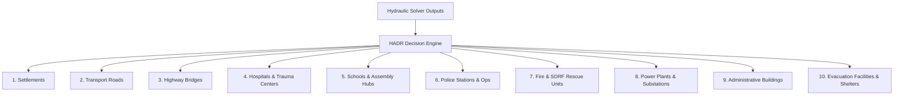

# PHASE 17 — INFRASTRUCTURE IMPACT AND HADR SPECIFICATION

## 1. Overview & Governing Mandate

The **FloodHADR Infrastructure Impact & HADR Decision Support Engine** evaluates structural risk, road accessibility, critical asset threat, lead warning time, and evacuation routing across downstream populations.

> [!IMPORTANT]
> **NO FLOOD MODEL INSIDE HADR MANDATE:**
> 1. The HADR engine DOES NOT contain a separate or duplicate hydraulic solver.
> 2. HADR evaluation strictly consumes output water depths $h(r, c, t)$, velocities $v(r, c, t)$, arrival times $T_{\text{arr}}$, and inundated extents directly from authoritative hydraulic solvers (`FloodHADR SWE`, `FloodHADR DWE`, `HEC-RAS SWE`, `HEC-RAS DWE`).

---

## 2. Asset Calculation Schema (14 Mandatory Fields)

For every infrastructure asset evaluated, HADR calculates precisely the 14 mandatory fields:

| Field | Description | Calculation / Source |
| :--- | :--- | :--- |
| `asset_id` | Unique asset identifier | e.g. `ast-hosp-district` |
| `asset_type` | Category (1 of 10) | `settlements`, `roads`, `bridges`, `hospitals`, `schools`, `police`, `fire/rescue`, `power`, `administrative buildings`, `evacuation facilities` |
| `location` | Geographic & 3D position | `{ "lat": 30.368, "lng": 78.472, "world_x": -25.0, "world_z": 25.0 }` |
| `ground_elevation` | Terrain elevation | $z_{\text{ground}}\text{ [m MSL]}$ derived from study DEM |
| `maximum_depth` | Peak water depth | $h_{\max}\text{ [m]}$ consumed directly from solver |
| `maximum_velocity` | Peak flow velocity | $v_{\max}\text{ [m/s]}$ consumed directly from solver |
| `arrival_time` | Wetting lead time | $T_{\text{arr}}\text{ [min]}$ to initial flood surge |
| `flood_duration` | Inundation time | $T_{\text{dur}}\text{ [hr]}$ water depth $> 0.05\text{m}$ |
| `hazard` | Hazard level | `LOW` ($< 0.5\text{m}$), `MODERATE` ($0.5 - 1.5\text{m}$), `HIGH` ($1.5 - 3.0\text{m}$), `SEVERE` ($\ge 3.0\text{m}$) |
| `accessibility` | Transport state | `ACCESSIBLE` ($h < 0.3\text{m}$), `RESTRICTED` ($0.3 - 0.8\text{m}$), `BLOCKED` ($h \ge 0.8\text{m}$ or $v \ge 2.0\text{m/s}$) |
| `scenario_id` | Active scenario ID | e.g. `scen-tehri-overtop` |
| `run_id` | Execution run ID | e.g. `sim-2026-001` |
| `model` | Active solver selector | `FloodHADR SWE`, `FloodHADR DWE`, `HEC-RAS SWE`, `HEC-RAS DWE` |
| `provenance` | Data lineage | `REAL`, `OBSERVED`, `SCENARIO`, `DEMO` |

---

## 3. Supported 10 Infrastructure Categories

---

## 4. Generated 7 HADR Decision Support Outputs

1. **Affected Infrastructure:** Complete evaluation catalog listing all assets with the 14 calculation fields.
2. **Potentially Blocked Roads:** Transport corridors where maximum depth $h \ge 0.3\text{m}$ or velocity $v \ge 1.5\text{m/s}$, tagged as `CAUTION` or `IMPASSABLE`.
3. **Critical Assets:** High-priority facilities (hospitals, power plants, police, fire stations, admin centers, bridges) under `HIGH` or `SEVERE` hazard.
4. **Warning Time:** Lead time between breach initiation ($T=0$) and surge arrival ($T_{\text{arr}}$) at each asset.
5. **Evacuation Routes:** Recommended egress corridors linking inundated valley sectors to high-ground relief shelters.
6. **Safe Zones:** High-ground assembly areas and relief camps ($h = 0.0\text{m}$).
7. **Scenario Impact Comparison:** Quantitative impact diff across scenarios (e.g. FRL $830\text{m}$ vs MDDL $740\text{m}$) or solver models (`FloodHADR SWE` vs `FloodHADR DWE` vs `HEC-RAS`).

---

## 5. DEMO Mode & Synthetic Infrastructure Rules

> [!WARNING]
> **SYNTHETIC INFRASTRUCTURE RULE:**
> Synthetic or generated test infrastructure features are permitted **ONLY in DEMO mode**. Every synthetic feature must carry `"provenance": "DEMO"`, `"is_synthetic_demo": True`, and explicit `"DEMO"` label tags. Real ground survey features carry `"provenance": "REAL"` or `"provenance": "OBSERVED"`.

---

## 6. REST API & Automated Verification Suite

- **REST Endpoints:** Exposed via `GET /api/gis/hadr/impact` and `POST /api/gis/hadr/impact`.
- **Automated Regression Suite:** Implemented in `backend/test_phase17_hadr.py` verifying all 14 mandatory fields, 10 asset categories, 7 HADR outputs, and synthetic `DEMO` labeling rules.
