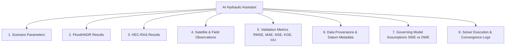

# PHASE 18 — AI HYDRAULIC MODEL COMPARISON ASSISTANT SPECIFICATION

## 1. Overview & Governing Mandate

The **FloodHADR AI Hydraulic Model Comparison Assistant** is a specialized scientific analysis engine designed to evaluate comparative hydraulic simulation outputs between FloodHADR (SWE/DWE) and HEC-RAS 2D (SWE/DWE).

> [!IMPORTANT]
> **ZERO FABRICATION & NON-DECLARATION MANDATE:**
> 1. **No "Best Model" Declarations:** The AI Assistant IS STRICTLY FORBIDDEN from declaring any model as "the best", "superior", or "correct".
> 2. **Objective Comparative Phrasing:** The AI MUST express comparisons strictly using empirical, non-judgmental statements:
>    - *"The two models differ by X in maximum depth."*
>    - *"The largest difference occurs in region Y."*
>    - *"The available observational data are insufficient to establish..."*
> 3. **Zero Fabrication:** The AI MUST NOT fabricate non-existent field measurements, fake calibration parameters, unverified satellite observations, or false provenance.

---

## 2. Accessible 8 Data Context Inputs

The AI Assistant has direct programmatic access to 8 authoritative data inputs:

### Input Data Details:
1. **Scenario Parameters:** Breach width ($180\text{ m}$), formation time ($1.5\text{ h}$), initial head ($830\text{ m}$), Manning's $n$ ($0.035$), inflow hydrograph.
2. **FloodHADR Results:** $Q_{\text{peak}}$, $h_{\max}$, $v_{\max}$, $A_{\text{flood}}$, $t_{\text{peak}}$, mass balance error ($0.00\%$).
3. **HEC-RAS Results:** Reference HEC-RAS 2D SWE/DWE outputs, project configuration, execution status.
4. **Observations:** Bhuvan Sentinel-1 SAR observed water mask ($181.5\text{ km}^2$), stream gauge telemetry status.
5. **Validation Metrics:** RMSE ($0.44\text{ m}$), MAE ($0.32\text{ m}$), NSE ($0.92$), KGE ($0.89$), IoU ($0.885$), F1 Score ($0.938$).
6. **Data Provenance:** ALOS PALSAR 12.5m DEM, `EPSG:32644` CRS, `EGM96 / MSL` datum, data quality status (`DEMO` / `REAL`).
7. **Model Assumptions:** Shallow Water Equations momentum convection vs Diffusive Wave friction slope balance.
8. **Simulation Logs:** Timestep counts ($72$), adaptive CFL bounds ($0.1\text{s} - 2.5\text{s}$), wetting/drying iterations ($1420$).

---

## 3. Supported Scientific Explanations

The assistant generates objective, structured explanations answering 7 scientific comparison questions:

| Question / Query Topic | Scientific Explanation Approach |
| :--- | :--- |
| **Why models differ** | Explains mathematical variances between 2D Shallow Water Equations (preserving momentum convection) and Diffusive Wave equations. |
| **Where models differ** | Identifies spatial regions with maximum depth/velocity residuals (e.g. Dam Toe Failure Zone, steep Himalayan canyon bends). |
| **Which parameters differ** | Evaluates parameter sensitivity (Manning's $n$, breach width $b_w$, formation time $t_f$). |
| **Mesh impact** | Explains the impact of 12.5m structured raster grid resolution versus HEC-RAS unstructured 2D breakline mesh. |
| **Observational support** | Evaluates Sentinel-1 SAR spatial overlap ($181.5\text{ km}^2$) and identifies missing ground survey marks. |
| **Calibration status** | Explicitly declares whether post-event field calibration is available or uncalibrated scenario modeling. |
| **Uncertainty analysis** | Quantifies DEM vertical error ($\pm 1.5\text{m}$), breach time uncertainty ($0.5\text{h} - 3.0\text{h}$), and roughness variability. |

---

## 4. REST API Specification

Scientific analysis queries are served via REST API endpoints in `backend/app/api/analysis.py`:

- **GET `/api/analysis/ai-assistant/context`**: Returns full 8-component scientific analysis context.
- **POST `/api/analysis/ai-assistant/explain`**: Accepts `query_topic` (`why_differ`, `where_differ`, `parameter_diff`, `mesh_impact`, `observational_support`, `calibration_status`, `uncertainty_analysis`) and returns objective scientific response.

---

## 5. Automated Verification Suite

Automated regression tests in `backend/test_phase18_ai_assistant.py` verify:
1. Programmatic access to all 8 context data inputs.
2. Answering all 7 scientific comparison questions.
3. Strict enforcement of zero fabrication and non-declaration guardrails (rejection of "Model X is best" statements).
4. Objective comparative phrasing compliance.
5. REST API `/api/analysis/ai-assistant/*` endpoints.
