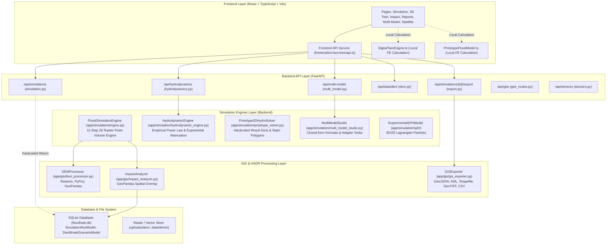

# Phase 1 — FloodHADR Architecture Map

**System:** FloodHADR v2  
**Audit Date:** September 26, 2026  
**Status:** AUDIT ARCHITECTURE MAP (EXISTING SYSTEM)  

---

## 1. High-Level Existing System Architecture



---

## 2. Existing Data Flows & Disconnections

### A. Current Simulation Data Flow (Fragmented)
Currently, 4 distinct pathways produce simulation numbers:
1. **Pathway A (Authoritative Engine Core - `engine.py`):**
   `DEMGrid` + `InitialConditions` + `DamBreachModel` + `WaterPropagationSolver` + `VelocityEstimator` + `InundationTracker` $\rightarrow$ `SimulationResult`.
   *(Status: Valid numerical implementation, but not called by the primary `/api/simulations` POST router).*
2. **Pathway B (API Simulation Router - `api/simulation.py`):**
   POST request received $\rightarrow$ Creates `SimulationRunModel` record with hardcoded constants (`14.6m`, `8.4 m/s`, `184.2 km²`, `142,500 pop`) $\rightarrow$ Returns without running engine.
3. **Pathway C (Analytical Hydrodynamic Engine - `hydrodynamic_engine.py`):**
   Uses closed-form formulas: $h = 0.4 \cdot Q^{0.38}$ and spatial wave attenuation $e^{-\text{dist}/(1200 + 0.02Q)}$ on synthetic grid.
4. **Pathway D (Frontend Local Engines - `DigitalTwinEngine.ts` & `PrototypeFloodModel.ts`):**
   Frontend computes flood spread locally using TypeScript functions and `Math.random()` for 3D animation.

### B. Current 2D Map Data Flow
- 2D Map (`GISMapModule.tsx` / `FloodMapPage.tsx`) receives scenario parameters from React state.
- Fetches vector overlays or calls `/api/simulations/{id}/export/geojson` (which uses `gis_exporter.py` 4 static polygons) or uses client-side GeoJSON fallback (`mockData.ts`).

### C. Current 3D Digital Twin Data Flow
- 3D Digital Twin (`DigitalTwin3DPage.tsx`) initializes `DigitalTwinEngine.ts`.
- Generates procedural DEM heightmap via polynomial formula (`830 - normR * 330 + valleyWallHeight`).
- Advances time step internally on the client, calculating water depth and wave front position locally.
- **Disconnection:** 3D twin does not share simulation run ID or frame matrices with the 2D map.

### D. Current HADR Spatial Impact Data Flow
- `ImpactAnalyzer` in backend (`app/gis/impact_analyzer.py`) performs spatial intersection using GeoPandas between flood polygons and infrastructure layers.
- Duplicate depth threshold checking logic exists in `predictive_hazard_engine.py` (`_get_affected_assets()`) and frontend `PrototypeFloodModel.ts`.

### E. Current HEC-RAS Status
- HEC-RAS functionality is represented by `HECRASAdapter` class in `multi_model_studio.py`.
- Metadata is flagged: `is_installed_and_tested=False`, `model_notice="ADAPTER IMPORT/EXPORT READY — HEC-RAS ENGINE NOT INSTALLED LOCALLY"`.
- No active HEC-RAS 2D numerical solver, CLI wrapper, or output parser exists in the backend.

---

## 3. Critical Architectural Problems Identified

1. **Lack of Single Authoritative Simulation Source:** Multiple engines and fallback pathways generate competing flood numbers.
2. **Frontend Simulation Autonomy:** The frontend calculates flood depth and wave propagation independently in TypeScript instead of consuming backend simulation frames.
3. **Hardcoded Fallbacks in API Services:** Endpoints return fixed default constants when disconnected or on new simulation creation.
4. **Disconnected 2D Map and 3D Twin Runtimes:** The 2D map and 3D digital twin run on separate simulation states and procedural terrain representations.
5. **Adapter Stubs for Model Comparison:** External model adapters (HEC-RAS, Delft3D, DeepANN) return synthetic power-law estimates rather than running validated benchmark comparisons.
6. **Hardcoded API Base URLs:** `API_BASE_URL` is hardcoded as `http://localhost:8000/api` in frontend services.

---

## 4. Recommended Correction & Migration Order

```
[Phase 1: Deep Audit & Map] ──► COMPLETE (Documentation Created)
         │
         ▼
[Phase 2: Consolidation of Authoritative Simulation Source]
  - Make FloodSimulationEngine (engine.py) the SINGLE simulation source
  - Remove frontend-side flood math & competing backend formula engines
         │
         ▼
[Phase 3: Data Lineage & Provenance Tracker]
  - Attach simulation_id, scenario_id, timestamp, CRS, and provenance tag to all outputs
         │
         ▼
[Phase 4: Parameter Sensitivity & Monotonicity Verification]
  - Enforce physical responsiveness to breach width, storage volume, roughness, DEM
         │
         ▼
[Phase 5: Numerical Stability & Mass Balance Rigor]
  - Verify CFL adaptive dt, non-negative depth invariant, and mass conservation reporting
         │
         ▼
[Phase 6: Benchmark & HEC-RAS Integration Engine]
  - Implement actual HEC-RAS reference parser and metric comparison suite (RMSE, MAE, IoU)
         │
         ▼
[Phase 7: Synchronized 2D Map & 3D Digital Twin Pipeline]
  - Bind 3D mesh surface to backend DEM; stream identical backend SimulationFrame series to 2D & 3D
         │
         ▼
[Phase 8: HADR Impact Consolidation & Decision Support]
  - Consolidate HADR spatial calculation in backend GeoPandas ImpactAnalyzer
         │
         ▼
[Phase 9: AI Assistant Grounding & Verification]
  - Ground AI responses on empirical metrics and explicit simulation provenance
         │
         ▼
[Phase 10: Standalone DEMO Mode & Failure Safeguards]
  - Isolate synthetic DEMs and offline feeds behind clear DEMO MODE indicators
         │
         ▼
[Phase 11: End-to-End Build & Automated Verification]
  - Run full test suite, frontend build, API verification, and generate final audit matrix
```
