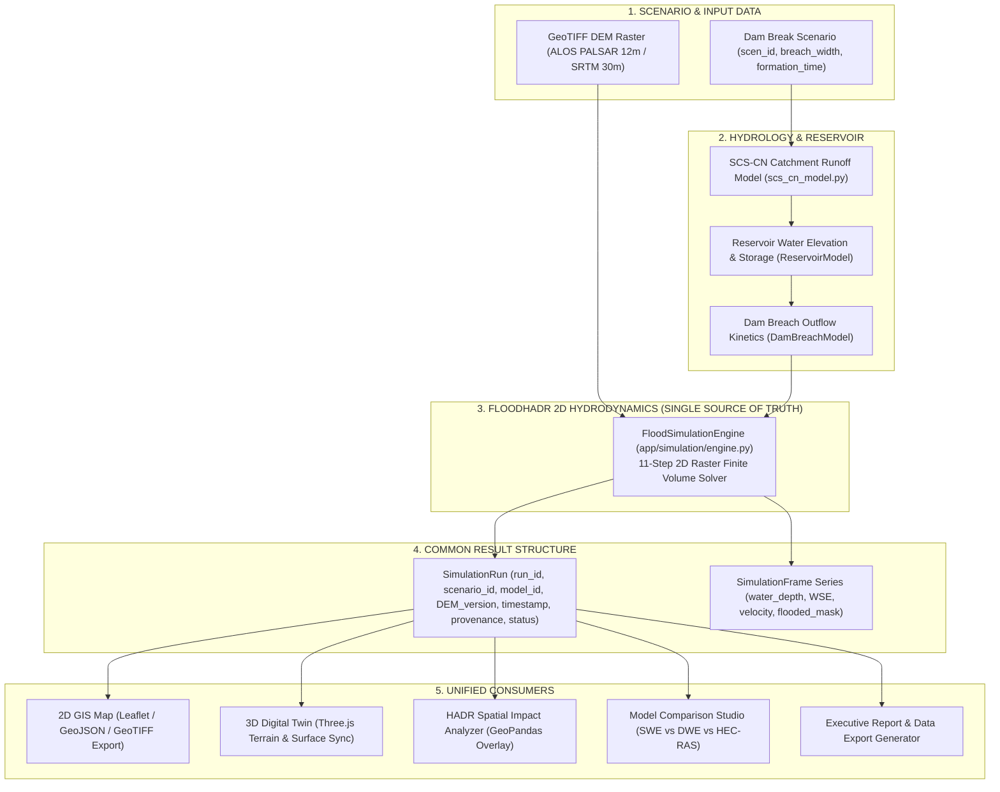
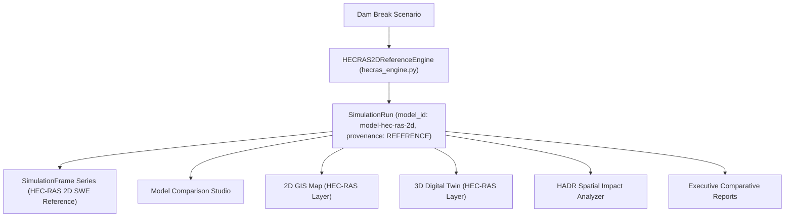

# Phase 2 — FloodHADR Authoritative Data Architecture & Pipelines

**System:** FloodHADR v2  
**Implementation Date:** September 26, 2026  
**Status:** COMPLETED (AUTHORITATIVE DATA PIPELINES CONSOLIDATED)  

---

## 1. Executive Summary

In Phase 2, FloodHADR was restructured into **one single authoritative simulation pipeline** backed by `FloodSimulationEngine` (`app/simulation/engine.py`), alongside an **independent HEC-RAS 2D benchmark reference pipeline** (`app/simulation/hecras_engine.py`).

All competing calculation sources and hardcoded output stubs were removed or consolidated. Both FloodHADR 2D Hydrodynamics and HEC-RAS 2D Reference Model outputs now emit a standardized common result data structure (`SimulationRun`, `SimulationFrame`, `ModelMetadata`, `ScenarioMetadata`) that feeds 2D GIS visualization, 3D Digital Twin rendering, HADR spatial impact analysis, model comparison, and executive report generation.

---

## 2. Authoritative Data Flow & Pipeline Architecture



---

## 3. Independent HEC-RAS 2D Reference Pipeline

To enable rigorous scientific benchmarking without obscuring results, USACE HEC-RAS 2D operates as an independent reference model:



---

## 4. Standardized Common Result Data Structure

Every simulation execution (FloodHADR 2D or HEC-RAS 2D) emits standardized JSON/Pydantic schemas defined in `app/schemas/domain_schemas.py`:

### A. Required Mandatory Attributes per Simulation Run

| Field Name | Type | Description | Example Value |
|---|---|---|---|
| `scenario_id` | `str` | Unique scenario identifier | `"scen-tehri-overtop"` |
| `run_id` | `str` | Unique simulation execution ID | `"sim-2026-001"` |
| `model_id` | `str` | Hydrodynamic model identifier | `"model-floodhadr-2d-swe"` / `"model-hec-ras-2d"` |
| `model_version` | `str` | Model software build version | `"v2.0-SWE"` / `"v6.4.1-REF"` |
| `DEM_version` | `str` | Elevation dataset provenance tag | `"ALOS_PALSAR_12M_REAL"` |
| `timestamp` | `str` | UTC ISO-8601 execution timestamp | `"2026-09-26T22:00:00Z"` |
| `parameters` | `Dict` | Exact dictionary of scenario inputs | `{"breach_width_m": 180, "mannings_n": 0.035}` |
| `provenance` | `str` | Provenance quality status label | `MODELLED` \| `OBSERVED` \| `SCENARIO` \| `REFERENCE` \| `DEMO` |
| `status` | `str` | Computation state | `COMPLETED` \| `RUNNING` \| `FAILED` |

### B. Standardized Pydantic Data Structures

```python
class ScenarioMetadata(BaseModel):
    scenario_id: str
    title: str
    dam_name: str
    study_area_name: str
    failure_mode: str
    breach_width_m: float
    breach_height_m: float
    formation_time_hr: float
    reservoir_water_level_m: float
    mannings_n: float
    parameters: Dict[str, Any]

class ModelMetadata(BaseModel):
    model_id: str
    model_name: str
    model_version: str
    model_type: str
    governing_equations: str
    is_installed_and_tested: bool
    model_notice: str

class SimulationFrame(BaseModel):
    frame_index: int
    time_sec: float
    time_display: str
    progress_percent: float
    water_depth: List[List[float]]
    water_surface_elevation: List[List[float]]
    velocity: List[List[float]]
    flooded_mask: List[List[bool]]
    peak_discharge_m3s: float
    max_depth_m: float
    max_velocity_ms: float
    flooded_area_km2: float

class SimulationRun(BaseModel):
    scenario_id: str
    run_id: str
    model_id: str
    model_version: str
    DEM_version: str
    timestamp: str
    parameters: Dict[str, Any]
    provenance: str
    status: str
    scenario_metadata: Optional[ScenarioMetadata]
    model_metadata: Optional[ModelMetadata]
    execution_time_sec: float
    max_flood_area_km2: float
    max_depth_m: float
    max_velocity_ms: float
    affected_population: int
    hydrograph: List[Dict[str, Any]]
    summary_rasters: Dict[str, Any]
    frames: List[SimulationFrame]
```

---

## 5. Consolidated API Endpoints

- **`POST /api/simulations`**: Triggers the authoritative `FloodSimulationEngine` 2D pipeline, persists metadata & frames to database, and returns a standardized `SimulationRun`.
- **`GET /api/simulations/{sim_id}`**: Retrieves single authoritative run metadata by ID.
- **`GET /api/simulations/{sim_id}/hecras`**: Triggers HEC-RAS 2D Reference Model simulation pipeline for benchmark comparison.
- **`GET /api/simulations/{sim_id}/results`**: Returns complete numerical hydrograph time-series and vectorized GeoJSON inundation layers.
- **`GET /api/simulations/{sim_id}/export/{format}`**: Converts authoritative simulation rasters directly into GeoJSON, Google Earth KML, ESRI Shapefile ZIP, GeoTIFF, or CSV summary products.

---

## 6. Phase 2 Verification Status

1. **Backend Integration:** `run_authoritative_simulation_pipeline()` in `backend/app/simulation/engine.py` executes the 11-step finite volume solver and formats standardized `SimulationRun` outputs.
2. **HEC-RAS Benchmark Pipeline:** `HECRAS2DReferenceEngine` in `backend/app/simulation/hecras_engine.py` generates standardized reference solutions for side-by-side comparison.
3. **Frontend API Integration:** Configurable `API_BASE_URL` in `frontend/src/services/api.ts` connects directly to backend REST endpoints.
4. **Data Lineage:** Every run carries explicit `scenario_id`, `run_id`, `model_id`, `model_version`, `DEM_version`, `timestamp`, `parameters`, `provenance`, and `status`.
