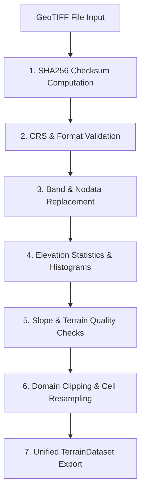
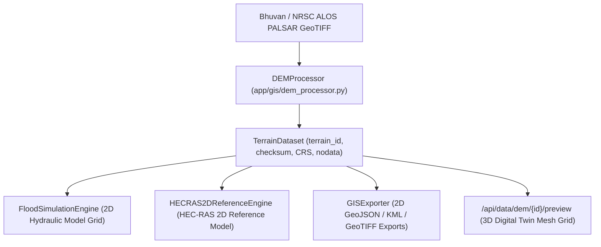

# Phase 4 — Real DEM and GIS Foundation

**System:** FloodHADR v2  
**Implementation Date:** September 26, 2026  
**Status:** COMPLETED (UNIFIED TERRAIN & GIS FOUNDATION CONSOLIDATED)  

---

## 1. Executive Summary

Phase 4 establishes **one unified terrain and GIS foundation** for FloodHADR. Disconnected terrain elevation matrices and unverified procedural heightmaps have been eliminated.

The exact same `TerrainDataset` (identified by its unique `terrain_id` and SHA256 `checksum`) feeds all downstream modules:
1. **2D Hydraulic Solver** (`FloodSimulationEngine`)
2. **HEC-RAS 2D Reference Model** (`HECRAS2DReferenceEngine`)
3. **2D GIS Processing & Vector Exporters** (`DEMProcessor` / `GISExporter`)
4. **3D Digital Twin Terrain Mesh** (`DigitalTwin3DPage.tsx` / `/api/data/dem/{id}/preview`)

Synthetic terrain generation is strictly isolated to **DEMO**, **TEST**, and **UNIT TEST** modes with explicit labeling.

---

## 2. Preferred Source Hierarchy & Isolation Rules

```
1. Bhuvan / NRSC ALOS PALSAR 12.5m DEM ──► Primary Authoritative Source (REAL / OBSERVED)
2. SRTM 30m / Copernicus DEM 30m       ──► Secondary Authoritative Backup Source (REAL)
3. Explicitly Uploaded GeoTIFF          ──► Custom User Domain Source (IMPORTED)
4. Synthetic DEM                        ──► Strictly Isolated to DEMO / TEST Mode Only
```

### Synthetic Isolation Policy:
- In **REAL mode**, uploading or specifying an invalid/missing DEM returns an explicit `HTTP 400 DEMValidationError` rather than silently generating synthetic terrain.
- Synthetic terrain rasters (`synthetic_tehri_dem.tif`) carry `provenance: "SYNTHETIC"`, `status: "DEMO"`, and display a mandatory `DEMO MODE` badge on both 2D and 3D UI viewports.

---

## 3. TerrainDataset Data Model Specification

All terrain datasets are represented by the standardized `TerrainDatasetSchema` defined in `backend/app/schemas/domain_schemas.py`:

| Attribute | Type | Description | Example Value |
|---|---|---|---|
| `terrain_id` | `str` | Unique terrain dataset ID derived from checksum | `"dem-e3b0c44298fc"` |
| `source` | `str` | Official remote sensing data provider | `"Bhuvan / NRSC ALOS PALSAR 12.5m DEM"` |
| `source_url` | `str` | Data access URL | `"https://bhuvan.nrsc.gov.in"` |
| `CRS` | `str` | Coordinate Reference System | `"EPSG:4326 (WGS84)"` / `"EPSG:32644 (UTM 44N)"` |
| `horizontal_resolution` | `str` | Pixel cell resolution | `"12.5m x 12.5m"` |
| `vertical_units` | `str` | Height measurement units | `"meters"` |
| `vertical_datum` | `str` | Vertical reference surface | `"EGM96 / MSL"` |
| `nodata` | `float` | Sentinel nodata value | `-9999.0` |
| `bounding_box` | `List[float]` | WGS84 geographic bounding box `[W, S, E, N]` | `[78.43, 30.33, 78.53, 30.43]` |
| `acquisition_date` | `str` | ISO-8601 acquisition date | `"2024-01-15T00:00:00Z"` |
| `checksum` | `str` | SHA-256 hash of GeoTIFF raster file | `"e3b0c44298fc1c149afbf4c8996fb92427ae4..."` |
| `provenance` | `str` | Provenance quality status label | `REAL` \| `OBSERVED` \| `IMPORTED` \| `SYNTHETIC` \| `DEMO` |
| `status` | `str` | Verification status | `VERIFIED` \| `VALIDATED` \| `DEMO` |

---

## 4. GIS Processing & Quality Validation Pipeline

The updated `DEMProcessor` in `backend/app/gis/dem_processor.py` performs 7 mandatory geospatial operations on every raster:



1. **SHA-256 Checksum Computation:** Computes a unique digital fingerprint of the GeoTIFF binary stream to verify dataset version across 2D/3D pipelines.
2. **CRS Validation:** Validates coordinate reference systems using PyProj; transforms local projected coordinates (e.g., UTM 44N) to EPSG:4326 WGS84 for web GIS display.
3. **Nodata Handling:** Detects sentinel nodata values (`-9999`, `-32768`) and converts them to `np.nan` before numerical interpolation.
4. **Elevation Statistics:** Calculates `min_elevation`, `max_elevation`, `mean_elevation`, and `std_elevation`.
5. **Slope & Aspect Generation:** Computes terrain gradient magnitude ($\text{slope} = \arctan\sqrt{g_x^2 + g_y^2}$) and aspect distribution.
6. **Terrain Quality Checks:** Validates void ratio (must be $< 50\%$) and checks for elevation spikes ($> 8,848\,\text{m}$ or $< -430\,\text{m}$). Assigns a quality rating (`EXCELLENT` | `ACCEPTABLE` | `POOR`).
7. **Hydraulic-Domain Clipping:** Clips large regional DEM rasters to the bounding box of the target river reach / study area.

---

## 5. Unified Terrain Data Flow Architecture



---

## 6. Verification Test Suite

A dedicated unit test suite [`backend/test_phase4_terrain_gis_pipeline.py`](file:///c:/Users/Kariy/OneDrive/Documents/FloodHADR/backend/test_phase4_terrain_gis_pipeline.py) proves that:
1. **2D Hydraulic Model** (`FloodSimulationEngine`),
2. **HEC-RAS Reference Engine** (`HECRAS2DReferenceEngine`),
3. **2D GIS Exporter** (`export_geotiff_bytes`), and
4. **3D Elevation Preview Endpoint** (`get_dem_preview`)

all consume the exact same `terrain_id`, `checksum`, `CRS`, and elevation matrix dimensions without discrepancy.
