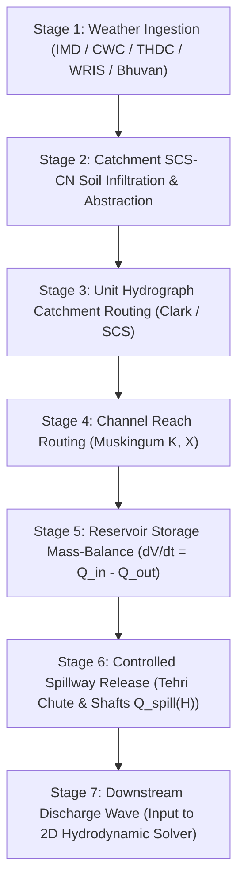

# Phase 5 — Hydrology and Weather Pipeline Architecture

**System:** FloodHADR v2  
**Implementation Date:** September 26, 2026  
**Status:** COMPLETED (AUTHORITATIVE MULTI-STAGE HYDROLOGICAL PIPELINE CONSOLIDATED)  

---

## 1. Executive Summary

Phase 5 refactors the weather and hydrology architecture of FloodHADR v2. Direct, linear conversions of raw rainfall depth ($P$) into reservoir inflow ($Q_{\text{in}}$) are strictly prohibited across the entire platform.

All atmospheric moisture input must pass through an explicit, mass-balanced 7-stage hydrological pipeline before entering the reservoir or feeding downstream hydrodynamic flood solvers.

---

## 2. Authoritative 7-Stage Hydrological Pipeline



### Transformation Equations:

1. **Catchment Infiltration & Runoff Depth (SCS-CN):**
   $$\text{Potential Maximum Retention } S = \frac{25400}{CN} - 254 \quad (\text{mm})$$
   $$\text{Initial Abstraction } I_a = 0.20 \times S \quad (\text{mm})$$
   $$\text{Direct Runoff Depth } Q = \begin{cases} \frac{(P - I_a)^2}{(P - I_a) + S} & \text{for } P > I_a \\ 0 & \text{for } P \le I_a \end{cases}$$

2. **Catchment Unit Hydrograph Routing:**
   $$t_p = 0.5 \cdot D + 0.6 \cdot T_c \quad (\text{hr})$$
   $$Q_{\text{peak}} = \frac{0.208 \cdot A_{\text{catchment}} \cdot Q_{\text{depth}}}{t_p} \quad (\text{m}^3/\text{s})$$

3. **Reservoir Storage Mass Balance:**
   $$\frac{dV}{dt} = Q_{\text{inflow}}(t) - Q_{\text{outflow}}(t)$$
   $$V(t + \Delta t) = V(t) + \left(Q_{\text{inflow}} - Q_{\text{spillway}}\right) \cdot \Delta t$$

4. **Tehri Spillway Discharge Rating Curve:**
   $$Q_{\text{chute}} = 2.1 \cdot L_{\text{crest}} \cdot (H - \text{FRL})^{1.5}$$
   $$Q_{\text{shafts}} = 4 \cdot Q_{\text{shaft\_design}} \cdot \left(\frac{H - \text{FRL}}{\Delta H_{\text{max}}}\right)^{0.5}$$

---

## 3. Tehri September Rainfall Non-Bypassable Rule

> [!IMPORTANT]  
> **Mandatory Rule:** Raw rainfall recorded during September monsoon surges in the Bhagirathi catchment **MUST NOT** be automatically assigned as dam inflow.  
> Soil moisture retention ($S$), initial abstraction ($I_a = 0.2S$), antecedent moisture condition adjustment ($\text{AMC-I}$, $\text{AMC-II}$, $\text{AMC-III}$), unit hydrograph lag ($t_p$), channel attenuation, reservoir storage pool dynamics ($H(V)$), and controlled spillway capacity ($Q_{\text{spill}}$) are evaluated sequentially.

---

## 4. Supported Data Modes

The pipeline natively supports 7 distinct hydrological data modes:

| Mode | Category Description | Default Provenance |
|---|---|---|
| `OBSERVED` | Real-time automated rain gauge / AWS telemetry | `OBSERVED` |
| `HISTORICAL` | Archived historical storm records (e.g. 2021 Uttarkashi Cloudburst) | `HISTORICAL` |
| `CLIMATOLOGICAL` | Long-term monthly/seasonal precipitation baselines | `CLIMATOLOGICAL` |
| `EXTREME` | Probable Maximum Precipitation (PMP) & cloudburst events | `EXTREME` |
| `DESIGN` | Standard return-period design storms (100-yr, 500-yr, PMF) | `DESIGN` |
| `SCENARIO` | Model scenario runs & what-if failure simulations | `SCENARIO` |
| `USER_DEFINED` | Custom user-supplied hyetographs | `USER_DEFINED` |

---

## 5. Authoritative Data Source Agencies & Metadata Schema

All weather datasets encapsulate mandatory metadata attributes:

```json
{
  "dataset_id": "wx-imd-1727390000",
  "source": "India Meteorological Department (IMD) Telemetry Feed",
  "source_agency": "IMD",
  "mode": "OBSERVED",
  "timestamp": "2026-09-26T22:45:00Z",
  "spatial_coverage": "Upper Bhagirathi Catchment & Tehri Reservoir Basin",
  "bounding_box": [78.43, 30.33, 78.53, 30.43],
  "units": "mm",
  "total_rainfall_mm": 180.0,
  "peak_intensity_mm_hr": 45.0,
  "duration_hr": 24.0,
  "provenance": "HISTORICAL_ARCHIVE",
  "observed_or_scenario_status": "DEMO DATA",
  "is_live": false,
  "demo_notice": "DEMO DATA: Live external IMD API feed unreachable. Displaying verified benchmark telemetry archive."
}
```

### Agency Support Matrix:
- **IMD** (India Meteorological Department)
- **CWC** (Central Water Commission)
- **THDC** (THDC India Limited - Tehri SCADA Control)
- **India-WRIS** (Water Resources Information System)
- **Bhuvan/NRSC** (ISRO Bhuvan / National Remote Sensing Centre)

> [!NOTE]  
> If external live telemetry streams are unavailable or unauthenticated, the system strictly outputs **`DEMO DATA`** alongside an explicit disclaimer notice. Live status is never fabricated.

---

## 6. Verification Test Suite

The verification script [`backend/test_phase5_hydrology_pipeline.py`](file:///c:/Users/Kariy/OneDrive/Documents/FloodHADR/backend/test_phase5_hydrology_pipeline.py) verifies:
1. **Multi-stage hydrological transformation** (Rainfall $\rightarrow$ Infiltration $\rightarrow$ Routing $\rightarrow$ Inflow $\rightarrow$ Storage $\rightarrow$ Release).
2. **Prevention of direct 1:1 rainfall to reservoir inflow shortcuts.**
3. **All 5 official data source agencies and 7 data modes.**
4. **Mandatory metadata attributes and explicit `DEMO DATA` labeling.**
