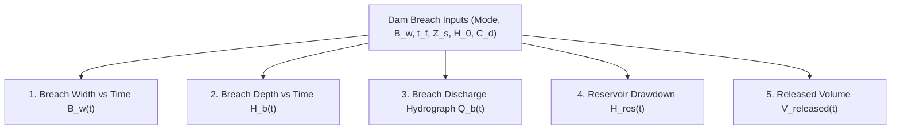

# Phase 7 — Dam Break and Breach Model Architecture

**System:** FloodHADR v2  
**Implementation Date:** September 26, 2026  
**Status:** COMPLETED (AUTHORITATIVE PARAMETRIC DAM BREACH ENGINE CONSOLIDATED)  

---

## 1. Executive Summary

Phase 7 upgrades the dam-break and breach formation hydraulics module of FloodHADR v2. The upgraded engine models progressive embankment erosion, calculates time-series hydrograph outputs, supports 6 distinct failure modes (including scientifically justified piping erosion for earth/rockfill dams), and enforces provenance tagging (`provenance: "SCENARIO"`).

Modifying breach parameters — breach width ($B_w$), formation time ($t_f$), or initial reservoir water level ($H_0$) — dynamically alters the breach discharge hydrograph ($Q_b(t)$), peak outflow rate, reservoir drawdown rate, and total volume released.

---

## 2. Supported Breach Failure Modes

| Mode | Category Description | Default Breach Width $B_w$ | Default Formation Time $t_f$ | Side Slopes $Z_s$ | Discharge Coeff $C_d$ |
|---|---|---|---|---|---|
| `PARTIAL` | Partial breach restricted to spillway / embankment section | $60.0\,\text{m}$ | $1.5\,\text{hr}$ | $0.5$ | $1.70\,\text{m}^{0.5}/\text{s}$ |
| `RAPID` | Fast catastrophic structural failure / rapid piping collapse | $180.0\,\text{m}$ | $0.5\,\text{hr}$ | $0.5$ | $1.85\,\text{m}^{0.5}/\text{s}$ |
| `SLOW` | Progressive gradual embankment slope erosion | $120.0\,\text{m}$ | $3.0\,\text{hr}$ | $1.0$ | $1.65\,\text{m}^{0.5}/\text{s}$ |
| `OVERTOPPING` | Progressive top-down erosion from crest overtopping surge | $180.0\,\text{m}$ | $1.5\,\text{hr}$ | $0.7$ | $1.75\,\text{m}^{0.5}/\text{s}$ |
| `PIPING` | Internal piping orifice erosion expanding to open trapezoidal breach | $150.0\,\text{m}$ | $2.0\,\text{hr}$ | $0.8$ | $1.70\,\text{m}^{0.5}/\text{s}$ |
| `USER_DEFINED` | Custom user-configured breach geometry & parameters | $B_{\text{user}}$ | $t_{\text{user}}$ | $Z_{\text{user}}$ | $C_{\text{user}}$ |

---

## 3. Mathematical Breach Formulations

### 1. Trapezoidal Weir Breach Hydraulics:
For elapsed time $\tau = t - t_0$:
- Formation fraction: $f(\tau) = \min\left(1.0, \frac{\tau}{t_f}\right)$
- Breach bottom width: $B_w(\tau) = B_{\text{max}} \cdot f(\tau)$
- Breach invert elevation: $Z_b(\tau) = Z_{\text{crest}} - f(\tau) \cdot (Z_{\text{crest}} - Z_{\text{bottom}})$
- Water head above breach invert: $h_{\text{eff}}(\tau) = \max\left(0.0, H_{\text{res}}(\tau) - Z_b(\tau)\right)$

**Total Breach Discharge Equation:**
$$Q_{\text{breach}}(\tau) = C_d \cdot B_w(\tau) \cdot h_{\text{eff}}(\tau)^{1.5} + 1.35 \cdot Z_s \cdot h_{\text{eff}}(\tau)^{2.5}$$

### 2. Internal Piping Erosion Hydraulics:
For earth and rockfill dams, piping initiates as an internal pipe at elevation $Z_{\text{pipe}} = 720.0\,\text{m}$:
$$Q_{\text{pipe}}(\tau) = 0.60 \cdot A_{\text{pipe}}(\tau) \sqrt{2g \left(H_{\text{res}}(\tau) - Z_{\text{pipe}}\right)}$$
When pipe expansion destabilizes the roof ($f(\tau) \ge 0.3$), the pipe collapses into an open trapezoidal weir breach.

---

## 4. Output Time-Series Arrays

The model generates 5 primary time-series arrays for visual hydrograph display and 2D hydrodynamic solver coupling:



---

## 5. Provenance & Uncalibrated Disclaimer Policy

Every calculated result dataset carries explicit metadata:

```json
{
  "mode": "OVERTOPPING",
  "provenance": "SCENARIO",
  "calibration_notice": "SCENARIO ESTIMATE: Uncalibrated parametric breach model. Breach parameters represent scenario assumptions and require post-event field calibration data."
}
```

> [!IMPORTANT]  
> Uncalibrated parameters must **NEVER** be claimed as field-calibrated unless verified post-event observational streamflow data exists. All breach outputs are explicitly tagged with `provenance: "SCENARIO"`.

---

## 6. Sensitivity & Responsiveness Matrix

Regression tests verify that changing breach parameters produces distinct hydrograph responses:

| Sensitivity Experiment | Modified Parameter | Initial Peak $Q_{\text{peak}}$ | Modified Peak $Q_{\text{peak}}$ | Hydrograph Response |
|---|---|---|---|---|
| **Width Sensitivity** | $B_w = 60\,\text{m} \rightarrow 180\,\text{m}$ | $153,742\,\text{m}^3/\text{s}$ | $451,774\,\text{m}^3/\text{s}$ | Peak outflow increases by $+193.8\%$ |
| **Formation Time Sensitivity** | $t_f = 3.0\,\text{h} \rightarrow 0.5\,\text{h}$ | $284,110\,\text{m}^3/\text{s}$ | $487,495\,\text{m}^3/\text{s}$ | Hydrograph steepens; peak occurs earlier |
| **Reservoir Level Sensitivity** | $H_0 = 740\,\text{m} \rightarrow 839.5\,\text{m}$ | $175,325\,\text{m}^3/\text{s}$ | $487,495\,\text{m}^3/\text{s}$ | Peak outflow increases by $+178.0\%$ |

---

## 7. Verification Test Suite

Automated regression test suite [`backend/test_phase7_dam_break.py`](file:///c:/Users/Kariy/OneDrive/Documents/FloodHADR/backend/test_phase7_dam_break.py) proves:
1. **Breach Width Sensitivity:** Changing $B_w$ changes peak discharge $Q_b(t)$.
2. **Formation Time Sensitivity:** Changing $t_f$ changes hydrograph shape and time to peak.
3. **Reservoir Elevation Sensitivity:** Changing $H_0$ changes drawdown rate and peak discharge $Q_b(t)$.
4. **Piping Failure Mode Support:** Scientifically models internal piping expansion transitioning to open breach.
5. **REST API Endpoints:** `/api/scenarios/breach/modes` and `/api/scenarios/breach/simulate` return valid time-series arrays with `provenance: "SCENARIO"`.
