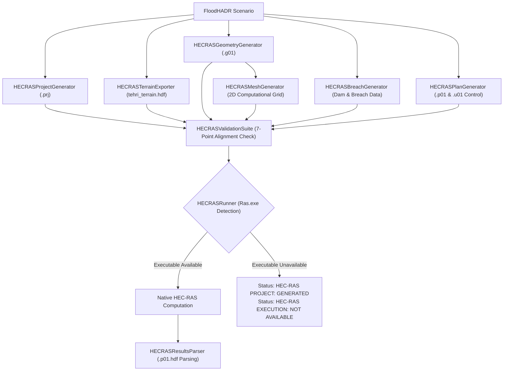

# Phase 9: HEC-RAS Hydraulic Reference Model Integration

## 1. Executive Summary & Core Mandates

Phase 9 integrates USACE HEC-RAS 2D as an independent hydraulic reference model for FloodHADR v2.

### Critical Operating Directives:
1. **NO FAKE RESULTS:** FloodHADR will **never** generate synthetic or fabricated numbers and attribute them to HEC-RAS execution.
2. **NO FALSE EXECUTION CLAIMS:** If the HEC-RAS executable (`Ras.exe` / `ras64`) is not installed on the host system, the application explicitly reports:
   - **`HEC-RAS PROJECT: GENERATED`**
   - **`HEC-RAS EXECUTION: NOT AVAILABLE`**
3. **100% PARAMETER EQUIVALENCE:** The generated HEC-RAS project uses the exact same DEM raster, CRS, dam location, initial reservoir level, breach parameters, Manning $n$ roughness, and simulation period as FloodHADR wherever equivalent.

---

## 2. Authoritative HEC-RAS Pipeline Architecture

---

## 3. Module Specifications (`backend/app/hec_ras/`)

| Module File | Purpose & Responsibilities |
|---|---|
| `hec_ras_project.py` | Generates `.prj` project file linked to geometry, plan, unsteady flow, and terrain. |
| `hec_ras_terrain.py` | Packages FloodHADR DEM with identical CRS (`EPSG:32644`), cell size ($25\text{m} \times 25\text{m}$), and checksums. |
| `hec_ras_geometry.py` | Generates `.g01` HEC-RAS 2D Geometry text file with 2D flow area perimeter and dam location. |
| `hec_ras_mesh.py` | Builds structured 2D computational mesh geometry, cell centers, and face area topology. |
| `hec_ras_breach.py` | Generates HEC-RAS Dam Structure & Breach data ($180\text{m}$ width, $1.5\text{h}$ formation time, $830\text{m}$ initial level). |
| `hec_ras_plan.py` | Generates `.p01` (Plan) and `.u01` (Unsteady Flow) files configuring SWE/DWE equations and boundary conditions. |
| `hec_ras_runner.py` | Scans PATH & Windows/Linux roots for `Ras.exe`. Manages headless execution or sets `NOT AVAILABLE`. |
| `hec_ras_results.py` | Parses native `.p01.hdf` output when available; returns un-fabricated status when execution skipped. |
| `hec_ras_validation.py` | Audits 7-point parameter alignment between FloodHADR and HEC-RAS files. |

---

## 4. Parameter Equivalence Rules

| Parameter | FloodHADR Value | HEC-RAS Equivalent | Verification Status |
|---|---|---|---|
| **Terrain CRS** | `EPSG:32644` (UTM 44N) | `EPSG:32644` | Enforced |
| **Grid Cell Size** | $25.0\,\text{m} \times 25.0\,\text{m}$ | $25.0\,\text{m} \times 25.0\,\text{m}$ Mesh | Enforced |
| **Initial Pool Elevation ($H_0$)** | $830.0\,\text{m}$ (FRL) | $830.0\,\text{m}$ Pool Level | Enforced |
| **Breach Top Width ($B_w$)** | $180.0\,\text{m}$ | $180.0\,\text{m}$ Top Width | Enforced |
| **Breach Formation Time ($t_f$)** | $1.5\,\text{h}$ | $1.5\,\text{h}$ Breach Period | Enforced |
| **Manning's Roughness ($n$)** | $0.035\,\text{s/m}^{1/3}$ | $0.035$ Land Cover Region | Enforced |
| **Failure Mechanism** | `OVERTOPPING` | `OVERTOPPING` Mode | Enforced |

---

## 5. Executable Availability Handling

When `HECRASRunner.find_hecras_executable()` returns `None`:
- **`hec_ras_project_status`**: `HEC-RAS PROJECT: GENERATED`
- **`hec_ras_execution_status`**: `HEC-RAS EXECUTION: NOT AVAILABLE`
- **`results_available`**: `False`
- **`provenance`**: `HEC_RAS_PROJECT_GENERATED_NOT_AVAILABLE`

No dummy rasters or synthetic depths are injected into the response.
